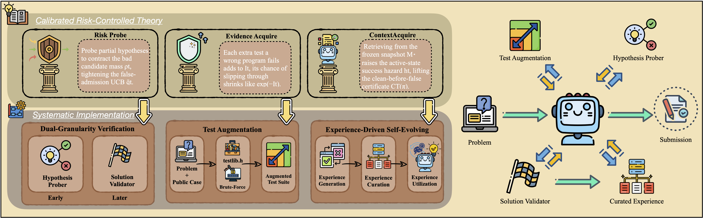

<div align="center">

#  💻🤖️ CP-Agent

CP-Agent: A Calibrated Risk-Controlled Agent for Feedback-Driven Competitive Programming

</div>

<div align="center"> 

</div>

## More Analysis

Additional rebuttal experiments, case studies, and efficiency derivations are
available in [proof and additional analysis](./proof_and_additional_analysis/README.md).

## 🎯Quick Start

#### Environment Preparation

```shell
uv sync
source .venv/bin/activate
```


#### Evaluation
Start Phoenix to monitor the traces.    
```
    python -m phoenix.server.main serve
```
    
Configure in `./agentflow/configs/config.yaml`
* Test on single problem:

  ```shell
    python ./agentflow/main_agent.py
  ```

* Test on single ICPC-Eval:
  ```shell
    sh ./ICPC-Eval/test_agent.sh
  ```
* Test on single LiveCodeBench Pro:
 ```shell
    sh ./LiveCodeBench-Pro/test_agent.sh
  ``` 

