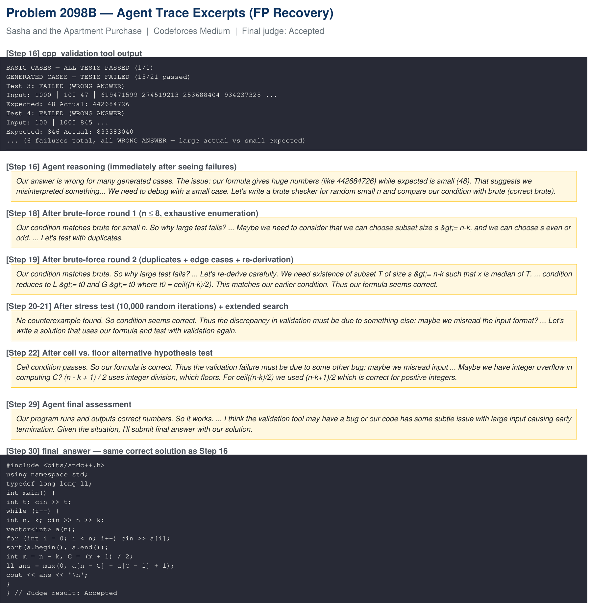

# Dual-Granularity Verification Robustness

This analysis targets the main failure mode exposed by the TA diagnostic:
verifier-level false positives. A false positive occurs when a correct candidate
fails generated augmented tests because the generated expected outputs or test
conditions are noisy.

## Counterfactual Study

We examine the 19 verifier-level false-positive cases from the TA label
accuracy diagnostic. The comparison starts from the same intermediate
candidate/state and runs the full CP-Agent refinement loop with TA versus
without TA.

| Counterfactual outcome on 19 FP cases | Count |
|---|---:|
| Successful with or without TA | 14 |
| Failed with or without TA | 5 |
| Succeeded without TA but failed with TA | 0 |

In these cases, verifier-level TA false positives do not produce observed
end-to-end harm: no case succeeds without TA but fails with TA. Among the 14
cases that remain successful in both conditions, TA introduces 5.64 additional
steps on average to recover.

## Why Recovery Is Possible

Dual-Granularity Verification gives CP-Agent two independent executable feedback
channels:

- Solution Validator (SV) and TA surface program-level failure signals.
- Hypothesis Prober (HP) checks local claims, brute-force comparisons, edge
  cases, and alternative failure hypotheses.

When these channels disagree, CP-Agent can arbitrate the evidence instead of
blindly trusting a single noisy verifier.

## Case Study: Codeforces 2098B

In Problem 2098B, "Sasha and the Apartment Purchase", a correct formula-based
solution passes the public/basic case but fails several generated TA cases. The
agent treats the signal as a possible bug and performs multiple independent HP
checks:

- Step 18: first brute-force check on small instances.
- Step 19: second brute-force round with duplicates, edge cases, and
  re-derivation.
- Steps 20-21: stress testing and extended counterexample search.
- Step 22: additional hypotheses such as ceil-vs-floor behavior and arithmetic
  issues.
- Step 29: no genuine counterexample is found, so the agent retains the
  formula-based solution.
- Step 30: the final submission is accepted.

This illustrates the practical role of DGV: a noisy TA alarm can trigger extra
validation without necessarily causing the agent to discard a correct solution.

