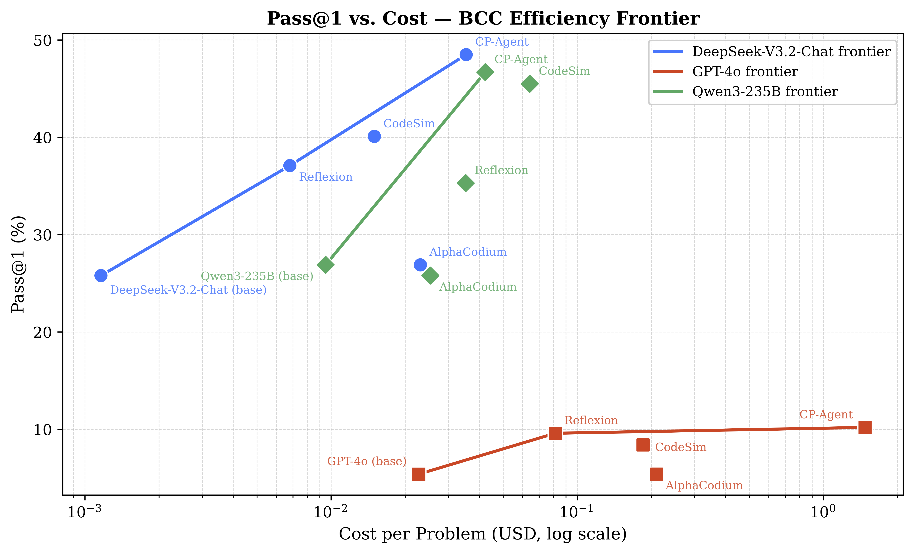

# Efficiency and BCC Derivation



The paper analyzes cost-performance trade-offs with Data Envelopment Analysis
(DEA), using the variable-returns-to-scale Banker-Charnes-Cooper (BCC) model.
The input is average API cost per problem, and the output is Pass@1. A method is
BCC-efficient when no observed method, nor any convex combination of observed
methods, can achieve at least the same output with no more input.

## Input-Oriented BCC Program

For each decision-making unit (DMU) `k` with input/output pair `(x_k, y_k)`,
the input-oriented BCC efficiency is computed by:

```text
minimize    theta
over        theta, lambda_j
subject to  sum_j lambda_j x_j <= theta x_k
            sum_j lambda_j y_j >= y_k
            sum_j lambda_j = 1
            lambda_j >= 0 for all j
```

The optimum `theta_k*` lies in `(0, 1]`. `theta_k* = 1` means the method lies on
the BCC frontier. `theta_k* < 1` means its input could be proportionally reduced
by `1 - theta_k*` while preserving at least the same output under the observed
frontier.

## DeepSeek-V3.2-Chat Data

Let `(x_j, y_j)` denote `(cost, Pass@1)`.

| Method | Cost `x` | Pass@1 `y` | Avg input tokens | Avg output tokens |
|---|---:|---:|---:|---:|
| DeepSeek-V3.2-Chat base | 0.001161236 | 25.8 | 892.3 | 2,671.9 |
| Reflexion | 0.006798761 | 37.1 | 29,631.6 | 13,100.9 |
| CodeSim | 0.014984270 | 40.1 | 41,883.2 | 31,314.0 |
| AlphaCodium | 0.023046801 | 24.5 | 89,478.1 | 45,552.7 |
| CP-Agent | 0.035377184 | 48.5 | 582,547.1 | 23,549.4 |

AlphaCodium is Pareto-dominated by DeepSeek-V3.2-Chat base because the
base method has both lower cost and higher Pass@1. Reflexion and CodeSim also
dominate AlphaCodium. The VRS/BCC frontier for the DeepSeek points is:

```text
DeepSeek-V3.2-Chat base -> Reflexion -> CP-Agent
```

These three frontier points have `theta = 1`.

## Closed-Form One-Input One-Output Computation

With one input, one output, and the BCC convexity constraint, any feasible
reference point is a convex combination of observed DMUs. For a target output
`y` between two frontier outputs `y_1 <= y <= y_2`, the minimal attainable input
on the frontier is obtained by linear interpolation:

```text
lambda(y) = (y - y_1) / (y_2 - y_1)
x*(y) = (1 - lambda(y)) x_1 + lambda(y) x_2
theta_k = x*(y_k) / x_k
```

For a target output below the lowest frontier output, this interpolation formula
does not apply. In that boundary case, the output constraint can already be
satisfied by the lowest-cost frontier point, so the optimal BCC reference is
that lowest-cost frontier point rather than a negative-lambda extrapolation.

### CodeSim

CodeSim has `y_S = 40.1`, between Reflexion (`37.1`) and CP-Agent (`48.5`), so
the best reference is a mixture of Reflexion and CP-Agent:

```text
lambda_S = (40.1 - 37.1) / (48.5 - 37.1)
         = 3 / 11.4
         = 0.2631579

x*(y_S) = (1 - 0.2631579) * 0.006798761
          + 0.2631579 * 0.035377184
        = 0.014319399

theta_S = 0.014319399 / 0.014984270
        = 0.9556
```

CodeSim is slightly inefficient under VRS/BCC and could reduce cost by about
`1 - 0.9556 = 4.44%` while maintaining the same Pass@1.

### AlphaCodium

AlphaCodium has `y_A = 24.5`, which is below the DeepSeek-V3.2-Chat base output
of `25.8`. Therefore the interpolation segment between DeepSeek-V3.2-Chat base
and Reflexion is not applicable. If one tried to use that segment anyway, it
would produce a negative interpolation weight:

```text
lambda_A = (24.5 - 25.8) / (37.1 - 25.8)
         = -1.3 / 11.3
         = -0.1150
```

This violates the BCC constraint `lambda_j >= 0`. Since the BCC output
constraint requires the reference point to achieve at least `y_A`, not exactly
`y_A`, the optimal reference is the lowest-cost frontier point, namely
DeepSeek-V3.2-Chat base:

```text
lambda_base = 1
lambda_j = 0 for all other methods

x*(y_A) = 0.001161236

theta_A = 0.001161236 / 0.023046801
        = 0.0504
```

Thus AlphaCodium is inefficient under VRS/BCC and could reduce cost by about
`1 - 0.0504 = 94.96%` while maintaining at least the same Pass@1 under the
observed frontier.

## Final DeepSeek VRS/BCC Efficiencies

| Method | BCC efficiency `theta` | Frontier status |
|---|---:|---|
| DeepSeek-V3.2-Chat base | 1.0000 | Frontier |
| Reflexion | 1.0000 | Frontier |
| CodeSim | 0.9556 | Inefficient |
| AlphaCodium | 0.0504 | Inefficient |
| CP-Agent | 1.0000 | Frontier |

The multi-backbone frontier figure extends this analysis to DeepSeek-V3.2-Chat,
GPT-4o, and Qwen3-235B. CP-Agent lies on the BCC frontier for all three
backbones, whereas some baselines are frontier-efficient only under particular
backbones.
