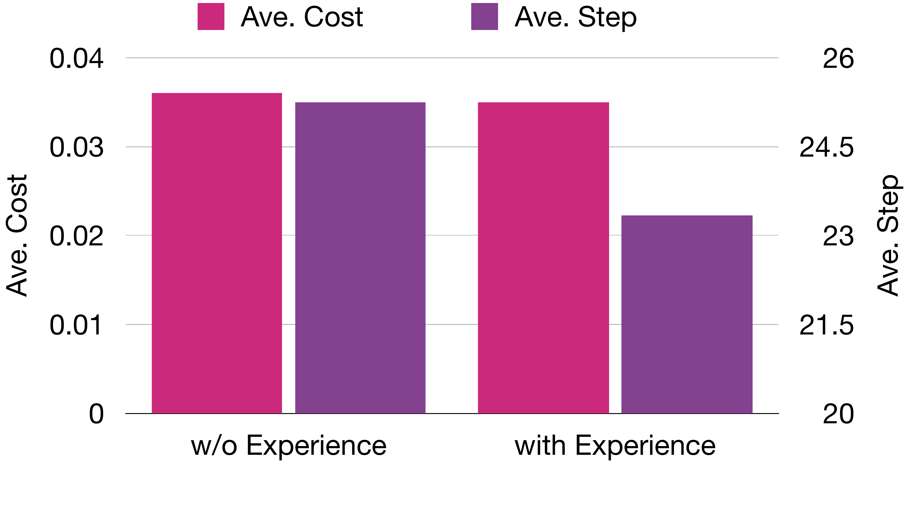

# Experience-Driven Efficiency

The Memory section of the main paper attributes the Experience module to
`ContextAcquire(k)`, whose effect in the Experience hazard proposition
(Section 2 of the main paper) is to lift the active-state success hazard
`h_t(M)`. Beyond the per-step acceptance lift reported in the main paper's
Experience-steps table, a higher `h_t` should also let CP-Agent commit earlier
in the refinement loop, with downstream effects on both the average number of
refinement steps and the per-problem cost. We isolate this efficiency channel
by an internal ablation of `pi*` that toggles only the frozen Experience
snapshot `M*` on the LCB-Pro target split (DeepSeek-V3.2-Chat backbone, with
the controller manifest from the main paper).

The figure is averaged over all `167` LCB-Pro problems, including unsolved
ones; this all-problem step count is therefore not identical to the
only-solved `#T` column of the calibrated-certificate table in the main paper,
which is reported on ICPC-Eval and averaged only over solved problems.

## Both Axes Move in the Right Direction

With Experience, the average refinement step count drops and the average
per-problem cost drops jointly. The same direction shows up in the component
ablation of the calibrated-certificate table: adding Experience on top of
`+SV+HP+TA` moves CP-Agent from `$0.043` to `$0.035` per problem and improves
the only-solved `#T` on ICPC-Eval from `2.2` to `1.8`, while raising LCB-Pro
Pass@1 from `46.1` to `48.5`. Two measurement axes — LCB-Pro all-problem
average in the figure above and ICPC-Eval only-solved `#T` in the
calibrated-certificate table — thus agree on the sign of the effect, while
differing in absolute magnitude due to the averaging convention.

## Mechanism Interpretation

The cost reduction is not driven by Experience being a cheaper module: the
[per-component token and cost breakdown](component_token_cost.md) shows
Experience itself consumes only `~3.4%` of the total tracked API cost.
Instead, the savings act through the certificate state. A higher `h_t(M)`
lets the admission gate `Gamma_t` close earlier on the trajectories that
would otherwise have continued, which in turn truncates the HP/SV invocations
downstream of those refinement steps. Since HP and SV together account for
`87.3%` of tracked cost, the saved HP/SV calls dominate the additional
retrieval cost incurred by Experience. In the language of Section 2 of the
main paper, `ContextAcquire` converts hazard lift into refinement-step
savings, and the savings on the expensive verification channels outweigh the
retrieval overhead — giving the qualitative claim in the experiment section
that "retrieved repair experiences reduce ineffective trial-and-error" a
concrete per-problem efficiency signature.

