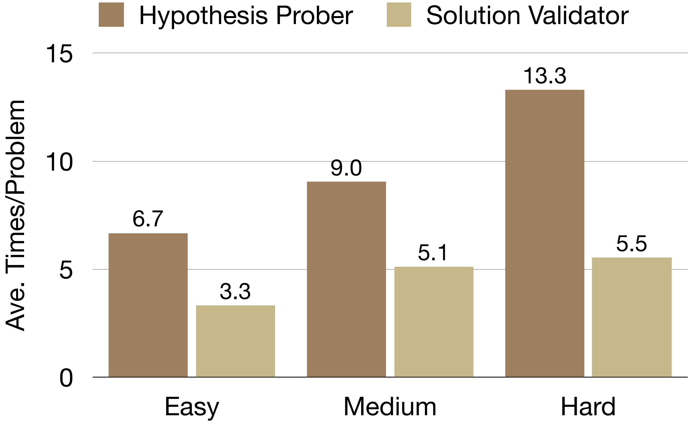

# Tool Use vs. Problem Difficulty

The main paper's verification-tool-by-step figure analyzes verification-tool
usage along the *interaction-step* axis on a single backbone. This analysis
complements that view with the orthogonal *difficulty* axis: how much
tool-mediated effort CP-Agent spends per problem as problems become harder.
The diagnostic uses the DeepSeek-V3.2-Chat backbone on LCB-Pro and counts the
average number of HP/SV/TA invocations per problem, broken down by the
benchmark's Easy/Medium/Hard difficulty bands.

## Adaptive Scaling on Easy/Medium

Compared with a fixed-pipeline baseline (each method calls every tool a
constant number of times), CP-Agent issues `5.5` tool calls per problem on
Easy and `5.1` on Medium. The slight drop from Easy to Medium reflects two
competing effects under the calibrated theory of Section 2 of the main paper:

- Medium problems trigger longer chain-of-thought before an executable
  candidate is produced, so HP and SV start firing later in the trajectory.
- Once an executable candidate is produced, the admission gate `Gamma_t`
  continues to require evidence, so tool calls remain non-trivial.

Empirically the two effects roughly cancel, and CP-Agent still relies heavily
on external feedback on Easy and Medium problems.

## Why Hard Drops to 3.3

On Hard problems, average tool calls drop to `3.3`. This is consistent with
two structural facts already documented in the main paper:

- *Few executable candidates are reached.* Hard problems often consume the
  budget on high-level algorithmic discovery before any candidate is produced.
  SV is only meaningful on executable candidates, and TA is only invoked when
  SV first returns pass on public tests; both channels stay neutral on
  trajectories that never reach this state. This is the same structural
  barrier that produces the unchanged Hard column in the frontier-reasoner
  table of the main paper: refinement-loop tools cannot substitute for
  missing high-level ideas.
- *Public-test-only filter.* The augmented suite `T_aug` is generated at most
  once per problem (the tool-orchestration algorithm in Appendix A),
  conditional on the candidate first passing public tests. On Hard problems
  this trigger fires rarely, suppressing the TA contribution to the
  per-problem call count.

In other words, the drop on Hard is not a controller-level decision to invoke
fewer tools, but a downstream consequence of the candidate stream itself
becoming sparse: the gates `G^HP_{i,t}`, `G^SV_{i,t}`, `G^TA_{i,t}` from the
tool-orchestration algorithm record neutral on inactive channels (the
stopped-process definition in Section 2). Combined with the main paper's
verification-tool-by-step figure, which shows HP concentrated in early
interaction steps, this gives a coherent picture: CP-Agent spends tool budget
where evidence is actionable, and remains efficient elsewhere by leaving
inactive channels neutral rather than firing them spuriously.

